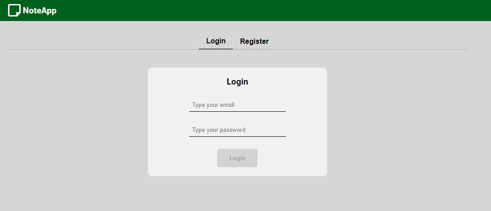

# note-app

## Description

NoteApp is a simple app for storing your own notes.
<ul>
    <li>login: test@test.com</li>
    <li>password: test123</li>
</ul>
Or you can create your own account using register form.

Stack used for this project:
<br />


<br />
Live:
https://noteapp-d9faf.web.app/

## Images

<p align="center">
  
  
  
  
  
</p>

## Project setup
```
yarn install
```

### Compiles and hot-reloads for development
```
yarn serve
```

### Compiles and minifies for production
```
yarn build
```

### Lints and fixes files
```
yarn lint
```

### Customize configuration
See [Configuration Reference](https://cli.vuejs.org/config/).
